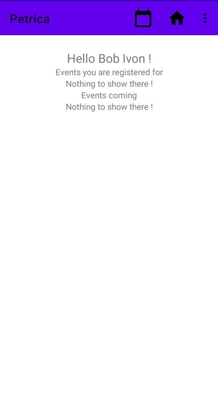
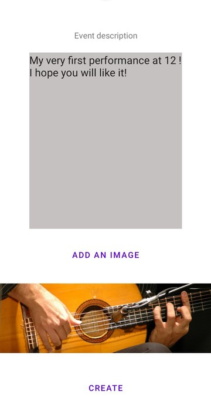
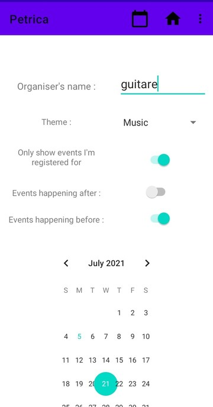

# Petrica
Petrica is an Android app for events managements. You find interesting events for you and register to them. You can also organise events.
Back-end is made with [Firebase](https://firebase.google.com/).

## Screenshots
&nbsp;&nbsp;&nbsp;
&nbsp;&nbsp;&nbsp;
&nbsp;&nbsp;&nbsp;
&nbsp;&nbsp;&nbsp;
&nbsp;&nbsp;&nbsp;
&nbsp;&nbsp;&nbsp;
&nbsp;&nbsp;&nbsp;
&nbsp;&nbsp;&nbsp;
&nbsp;&nbsp;&nbsp;
&nbsp;&nbsp;&nbsp;
&nbsp;&nbsp;&nbsp;
&nbsp;&nbsp;&nbsp;

## Installation
To build the app :
* Clone the master branch of repo
* Copy the folder **installation** elsewhere
* Create an [Android project with Firebase](https://firebase.google.com/docs/android/setup) (don't forget the Sha-1 certificate)
* Copy the google-services.json in the app folder
* Build with Android Studio

To configure Firebase :
* Open the folder **installation**
* Go into your firebase project settings
* Copy the rules (Storage rules.txt and Firestore rules.txt) into appropriate section in your firebase project [(see guide)](https://firebase.google.com/docs/guides)
* [Add the functions](https://firebase.google.com/docs/functions/get-started) (index.js)
* Active Firebase Authentication with Google and Email

If you want to add some as organiser (ie he will be able to create events) :
* Go into your firebase project settings
* Go into Database settings and choose Firestore
* Create an collection *organisers*
* Create an document whose name is the uid of the user and fields are the following :
  * *id_user* : uid of the user
  * *name_orga* : the name of the user as an organiser (his organisation or group)
  * *name_user* : name of the user
* If you want to add another organiser, add another document

 **NB :** To find the uid of an user, go into firebase project settings section Authentication and copy the **User ID**

## Components
* Firebase Authentication is used for authentication
* Firebase Storage is used for pictures storing
* Firebase Firestore is used for data persistence
* Firebase Functions is used to do some automatic actions
* Icons and themes are from [Material Desing](https://material.io/)
* [Glide](https://github.com/bumptech/glide) is used for image downloading and caching
